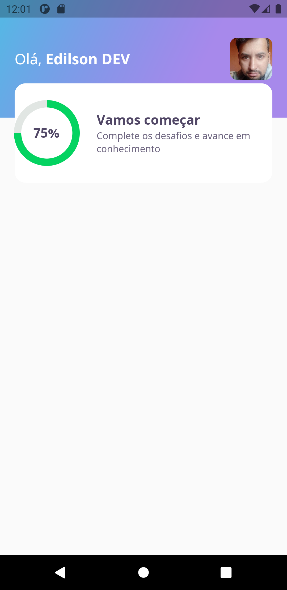
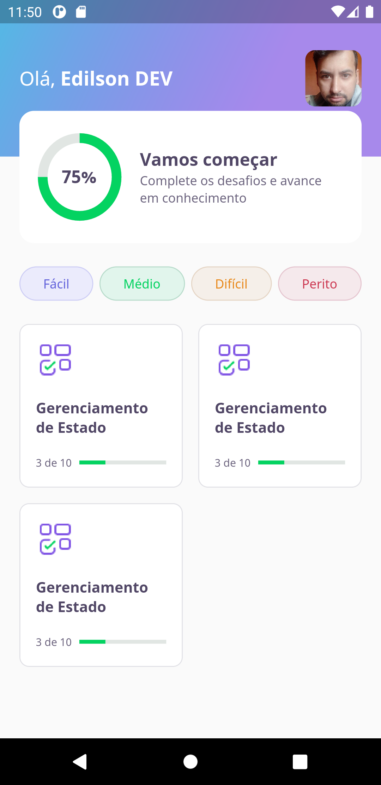
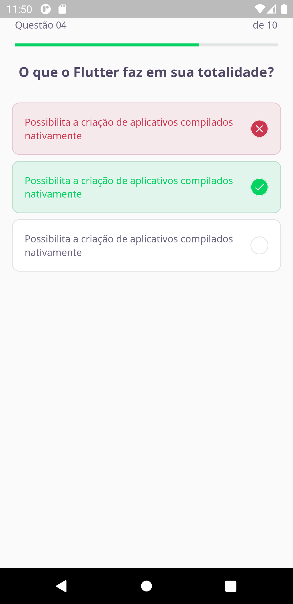
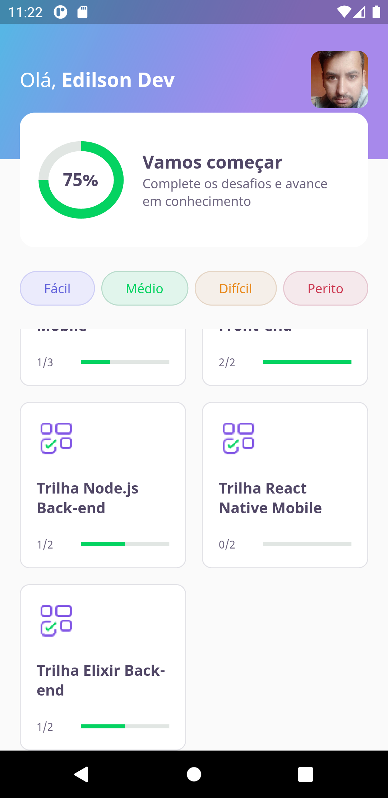

# flutter_quiz_nlw

We're go for launch. É hora de decolar e partir rumo ao próximo nível. Esse é o começo da nossa missão.

## First day #NLW 5 - Flutter Quiz

> requirements to run the project::

- flutter: 2.0+ with null safety applied.

> steps

- run flutter pub get no terminal
- flutter run in terminal

[sobre a NLW5](https://nextlevelweek.com/inscricao/5)

## Second day #NLW 5 - Flutter Quiz

We ended the home UI with statistical data.
At that moment I faced a problem with overflow in the QuizCard widget, the resolution was to use mediaquery. It was very good on my physical device and on my emulator.

We also created the dynamic questions screen, receiving the appropriate values, signaling the correct, wrong and standard questions.

## Third day #NLW 5 - Flutter Quiz

Today we leave our Home Page receiving dynamic data from our database, in json format, we work with repositories and controllers, ready to receive data from a server.
We create models for the scenario of our application.

