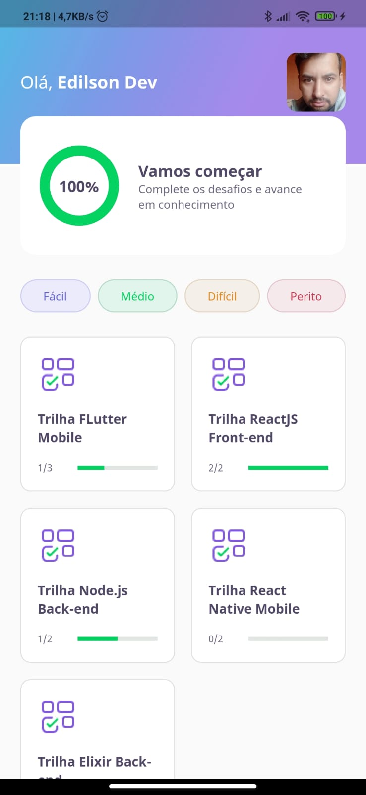
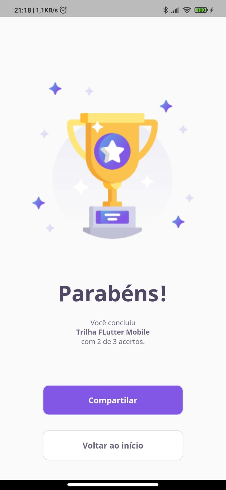
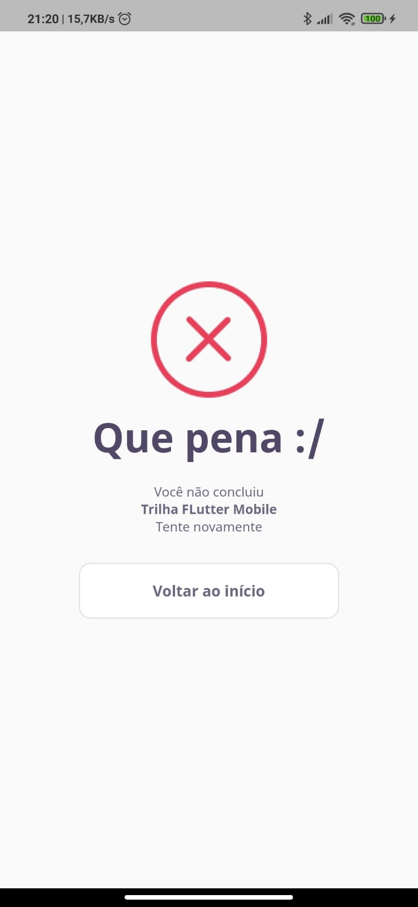
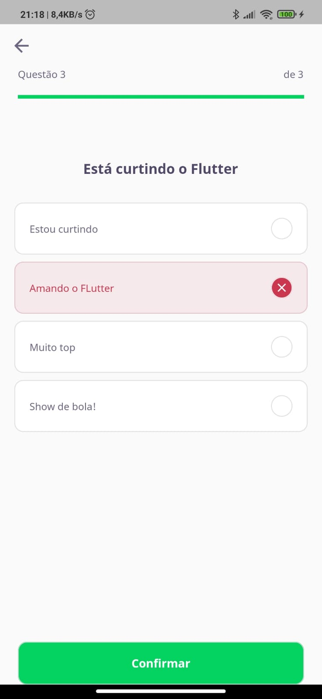
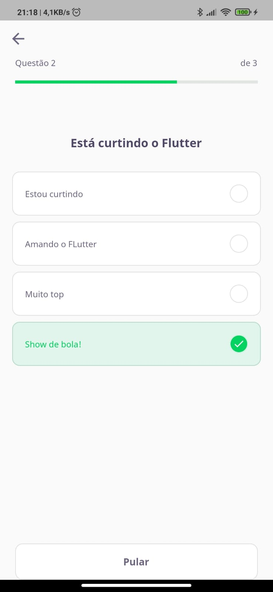

<h1 align="center">
   NLW 5 - Flutter Quiz
</h1>

<h2>
We're go for launch. É hora de decolar e partir rumo ao próximo nível. Esse é o começo da nossa missão.
</h2>
<br/>

# Indice

- [Sobre](#-sobre)
- [Tecnologias Utilizadas](#-tecnologias-utilizadas)
- [Como baixar o projeto](#-como-baixar-o-projeto)

## 🔖&nbsp; Sobre

Esse projeto foi desenvolvido como parte do maior evento de todos os tempos, a **NLW#5**, com o tema **QuizDev**.

---

## 🚀 Tecnologias utilizadas

O projeto foi desenvolvido utilizando as seguintes tecnologias

- [Dart](https://dart.dev/)
- [Flutter](https://flutter.dev/)

  **packages**

- [Google Fonts](https://pub.dev/packages/google_fonts)
- [Share Plus](https://pub.dev/packages/share_plus)

---

## Como baixar o projeto

```bash

    # Clonar o repositório
    $ git clone https://github.com/edilson-rodrigues/flutter_quiz_nlw.git

    # Entrar no diretório
    $ cd flutter_quiz_nlw

    # Instalar as dependências
    $ flutter pub get

    # Iniciar o projeto
    $ select a device to use
    $ f5 vscode | run > start debug
```

---

## Screens







---

<a>Desenvolvido por Edilson Rodrigues</a>
